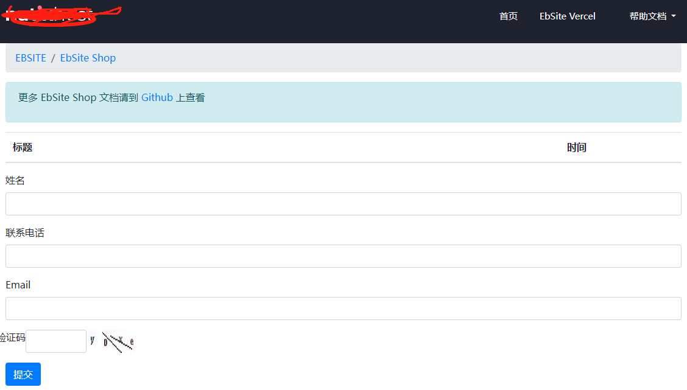

# 模型控件

模型控件是 EbSite CMS 中**模型字段编辑器**的核心组件。当你在后台设计内容模型（或分类模型）时，每个字段都需要绑定一个控件——控件决定了该字段在编辑页面中以什么形式呈现：文本框、图片上传、下拉选择还是更复杂的交互组件。

---

## 一、快速认识

在后台进入「模型管理」→「字段管理」，你会看到「选择控件」下拉框：



每个选项对应一个控件实例。选择不同的控件，最终在内容编辑页面中渲染出的 HTML 就不同。

---

## 二、内建控件一览

系统预置了一批通用控件，统一放在 `model_controls/` 目录下，ID 命名格式为 `sys_N`：

| ID | 控件名称 | 类名 | 说明 |
|----|---------|------|------|
| `sys_1` | 单行文本输入框-必填 | `SimpleInput` | 普通文本输入，带 `required` 验证 |
| `sys_2` | 多行文本输入框 | `MultilineInput` | `<textarea>` 多行输入 |
| `sys_3` | 富文本编辑框 | `HtmlInput` | UEditor 富文本编辑器 |
| `sys_4` | 数字输入框 | `NumberInput` | `type="number"` 数字输入 |
| `sys_5` | 单图上传控件 | `ImgUpload` | 单张图片上传，带预览 |
| `sys_6` | 单文件上传控件 | `FileUpload` | 单文件上传 |
| `sys_7` | 多图上传控件 | `ImgUploadList` | 多张图片批量上传 |
| `sys_8` | 多文件上传控件 | `FileUploadList` | 多文件批量上传 |
| `sys_9` | 单图上传-显示路径 | `FileImgUpload` | 单图上传仅显示路径文本 |
| `sys_11` | 单行文本输入框-选填 | `SimpleInputOptional` | 文本输入，不加 `required` |

所有内建控件源码位于 `model_controls/` 目录。

---

## 三、如何创建一个自定义控件

### 3.1 最简单的例子：天气选择控件

在 `model_controls/` 下新建 `weather_select.py`：

```python
from model_controls.control_base import ControlBase


class WeatherSelect(ControlBase):

    def __init__(self):
        super().__init__()
        self.id: str = 'sys_12'              # 全局唯一 ID
        self.name: str = '天气选择'           # 后台下拉框显示的名称
        self.info: str = '选择天气状况'        # 辅助说明

    def get_control_temp(self, field_model: dict) -> str:
        show_name = field_model.get('show_name')
        name = field_model.get('name')
        control_size = field_model.get('control_size')
        control_size = int(control_size)
        temp = ('<div class="mb-3">'
                f'<label>{show_name}</label>'
                f'<select name="{name}" class="form-control" '
                f'style="max-width:{control_size * 100}px" required>'
                '<option value="">请选择天气</option>'
                f'<option value="sunny" {}selected{}>晴天</option>'
                f'<option value="cloudy" {}selected{}>多云</option>'
                f'<option value="rainy" {}selected{}>雨天</option>'
                '</select>'
                '</div>')
        return temp
```

然后在 `model_controls/__init__.py` 中注册：

```python
from . import weather_select
```

重启应用后，后台「选择控件」下拉框就会多出「天气选择」选项。

### 3.2 模板语法说明

`field_model` 参数由系统自动传入，包含字段的以下属性：

| 字段 | 类型 | 说明 |
|------|------|------|
| `name` | str | 字段名称，也是存储到数据库的键名 |
| `show_name` | str | 后台设置的展示名称（标签文字） |
| `control_id` | str | 控件 ID，如 `sys_1` |
| `control_name` | str | 控件名称，如「单行文本输入框」 |
| `control_size` | str | 控件大小（1~10），实际像素 = size × 100px |

模板字符串中 `[[model.{name}]]` 是控件的数据绑定语法，渲染时会被替换为 `{{ model.{name} }}`（Jinja2 变量插值），最终显示字段的当前值。

---

## 四、模块专用控件

如果某个控件是某个模块专用的（比如 `aitanqin` 模块的「乐谱类型」选择），**建议放在模块目录下**，而不是 `model_controls/`。

### 4.1 目录结构

```
eb_modules/
├── eb_shop/
│   ├── shop_controls/               ← 商城模块专用控件目录
│   │   ├── __init__.py
│   │   └── product_sku.py           ← 商品规格控件
│   └── ...
└── aitanqin/
    ├── atq_controls/                ← 爱弹琴模块专用控件目录
    │   ├── __init__.py
    │   └── score_type_select.py     ← 乐谱类型控件
    └── ...
```

### 4.2 控件 ID 命名规范

| 位置 | 格式 | 示例 |
|------|------|------|
| 系统通用控件 | `sys_N` | `sys_1`、`sys_5` |
| 模块专用控件 | `模块名_N` | `aitanqin_1`、`eb_shop_1` |

### 4.3 注册方式

在模块的 `__init__.py` 末尾导入即可（参考 `eb_shop` 的做法）：

```python
# eb_modules/eb_shop/__init__.py 第115行
from . import pages
from .shop_controls import product_sku
```

系统通过 `ControlBase.__subclasses__()` 自动发现所有已加载的控件子类，**不需要在 `model_controls/__init__.py` 中注册**。但必须确保模块被加载时（即模块被启用），控件的导入语句能被执行到。

### 4.4 控件代码示例

以 `eb_modules/aitanqin/atq_controls/score_type_select.py` 为例：

```python
from model_controls.control_base import ControlBase


class ScoreTypeSelect(ControlBase):

    def __init__(self):
        super().__init__()
        self.id: str = 'aitanqin_1'
        self.name: str = '乐谱类型'
        self.info: str = '乐谱类型下拉选择'

    def get_control_temp(self, field_model: dict) -> str:
        show_name = field_model.get('show_name')
        name = field_model.get('name')
        control_size = field_model.get('control_size')
        control_size = int(control_size)
        temp = ('<div class="mb-3">'
                f'<label>{show_name}</label>'
                f'<select name="{name}" class="form-control" '
                f'style="max-width:{control_size * 100}px" required>'
                '<option value="">请选择乐谱类型</option>'
                f'<option value="1" {}selected{}>总谱</option>'
                f'<option value="2" {}selected{}>吉他独奏</option>'
                f'<option value="3" {}selected{}>钢琴独奏</option>'
                f'<option value="4" {}selected{}>架子鼓独奏</option>'
                f'<option value="5" {}selected{}>贝斯独奏</option>'
                f'<option value="6" {}selected{}>尤克里里独奏</option>'
                '</select>'
                '</div>')
        return temp
```

---

## 五、控件加载与冲突检测

### 5.1 加载机制

在 `bll/site_model.py` 中，`SiteModel.get_controls()` 通过 `ControlBase.__subclasses__()` 动态反射获取所有已加载的控件子类：

```python
@staticmethod
def get_controls() -> list[ControlBase]:
    subclasses = ControlBase.__subclasses__()
    instances = []
    seen_ids = {}
    for subclass in subclasses:
        instance = subclass()
        ctr_id = instance.id
        if ctr_id in seen_ids:
            raise Exception(
                f"模型控件ID冲突：'{seen_ids[ctr_id].__class__.__name__}' "
                f"和 '{instance.__class__.__name__}' "
                f"都使用了 ID='{ctr_id}'。"
            )
        seen_ids[ctr_id] = instance
        instances.append(instance)
    return instances
```

这意味着：

- 控件的发现是**自动的**，只要类被 import 即可
- 如果两个控件使用了相同的 ID，**系统会在启动时直接报错**，不会出现静默错误
- 控件可以在系统的任意位置定义（`model_controls/` 或模块目录），框架没有限制

### 5.2 ID 唯一性

控件 ID 在全局必须唯一。系统提供冲突检测机制，但最佳实践是遵循以下规则：

- **系统控件**：使用 `sys_N` 序列（`sys_1` ~ `sys_11`，后续依次递增）
- **模块控件**：使用 `模块名_N` 序列（如 `aitanqin_1`、`eb_shop_1`）

这样不同模块之间完全不会冲突，也不需要协调 ID 分配。

---

## 六、控件基类 ControlBase

所有模型控件继承自 `model_controls/control_base.py` 中的 `ControlBase`：

```python
class ControlBase(ABC):
    def __init__(self):
        self.id: str = ''      # 控件唯一标识，格式：模块名_序号
        self.name: str = ''    # 后台下拉框展示名称
        self.info: str = ''    # 辅助说明

    @abstractmethod
    def get_control_temp(self, field_model: dict) -> str:
        """返回控件的 HTML 模板字符串"""
        pass
```

### 需要子类实现的属性

| 属性 | 类型 | 说明 |
|------|------|------|
| `id` | `str` | 全局唯一标识，遵循 `模块名_序号` 格式 |
| `name` | `str` | 在后台下拉框中显示的名称 |
| `info` | `str` | 辅助说明信息 |

### 需要子类实现的方法

| 方法 | 返回 | 说明 |
|------|------|------|
| `get_control_temp(field_model)` | `str` | 返回控件的 HTML 模板字符串 |

---

## 七、高级用法：复杂交互控件

如果控件需要复杂的 JavaScript 交互（如 Vue 组件、文件上传、弹窗等），可以在 `get_control_temp` 返回的 HTML 中嵌入完整的 JS 代码。

参考 `eb_modules/eb_shop/shop_controls/product_sku.py`，它使用 Vue 2 实现了 SKU 规格管理、用户组价格设置、图片上传等复杂交互。关键模式：

```python
def get_control_temp(self, field_model: dict) -> str:
    # 1. 从 field_model 获取字段元数据
    show_name = field_model.get('show_name')
    name = field_model.get('name')

    # 2. 准备需要的数据（如从数据库查询用户组）
    import json
    user_groups_json = json.dumps(self.user_groups, ensure_ascii=False)

    # 3. 返回完整的 HTML（包含 JS）
    temp = """
        <div id="app">
            ...
            <!-- 隐藏 input 用于提交数据 -->
            <input type="hidden" name="#field_name#"
                   value='[[model.#field_name# | tojson ]]' ref="skuInput" />
            ...
        </div>
        <script src="...vue.js"></script>
        <script>
            // 完整的 Vue 组件逻辑
        </script>
    """

    # 4. 替换模板占位符
    temp = temp.replace("#field_name#", name)
    temp = temp.replace("#show_name#", show_name)
    temp = temp.replace("#user_groups_json#", user_groups_json)

    return temp
```

注意事项：

- 提交的数据通过 `<input type="hidden">` 传输，控件负责将复杂数据序列化为 JSON 字符串
- 模板中使用 `[[model.{name}]]` 绑定已有数据，渲染时会被 Jinja2 语法替换
- 脚本中的 CSS 选择器和元素 ID 应使用字段名 `{name}` 做后缀，避免同一页面多个控件冲突

---

## 八、常见问题

### 8.1 控件加载失败怎么办？

如果后台「选择控件」下拉框中找不到你的控件，请检查：

1. 控件类是否正确继承了 `ControlBase`
2. 是否在 `__init__.py` 或模块入口中 import 了控件文件
3. 控件的 `__init__` 方法是否调用了 `super().__init__()`
4. 检查启动日志是否有 ID 冲突的报错信息

### 8.2 模版不生效？

- `[[model.{name}]]` 最终会被渲染为 Jinja2 的 `{{ model.{name} }}`，确保变量名与字段名一致
- 如果是新控件，需要在后台重新打开字段编辑页面才会生效（控件列表是运行时动态加载的）

### 8.3 已有数据如何迁移？

如果你从旧版本升级，数据库中的 `control_id` 字段存储的是旧格式的 ID，请执行迁移脚本：

```bash
flask shell
>>> exec(open('tools/migrate_control_ids.py', encoding='utf-8').read())
>>> migrate_control_ids()
```

迁移脚本会自动将 `"1"` → `"sys_1"`、`"2"` → `"sys_2"` 等映射关系进行更新。对于旧版中 ID 冲突的 `"10"`（曾同时被两个模块使用），脚本会列出具体字段等待人工处理。

---

## 九、完整文件参考

```
model_controls/                  ← 系统通用控件
├── __init__.py                  ← 控件注册入口
├── control_base.py              ← 基类
├── simple_input.py              ← sys_1  单行文本输入框-必填
├── multiline_input.py           ← sys_2  多行文本输入框
├── html_input.py                ← sys_3  富文本编辑框
├── number_input.py              ← sys_4  数字输入框
├── img_upload.py                ← sys_5  单图上传控件
├── file_upload.py               ← sys_6  单文件上传控件
├── img_upload_list.py           ← sys_7  多图上传控件
├── file_upload_list.py          ← sys_8  多文件上传控件
├── fileImg_upload.py            ← sys_9  单图上传-显示路径
└── simple_input_optional.py     ← sys_11 单行文本输入框-选填

eb_modules/
├── eb_shop/
│   └── shop_controls/
│       └── product_sku.py       ← eb_shop_1 商品规格
└── aitanqin/
    └── atq_controls/
        └── score_type_select.py ← aitanqin_1 乐谱类型
```