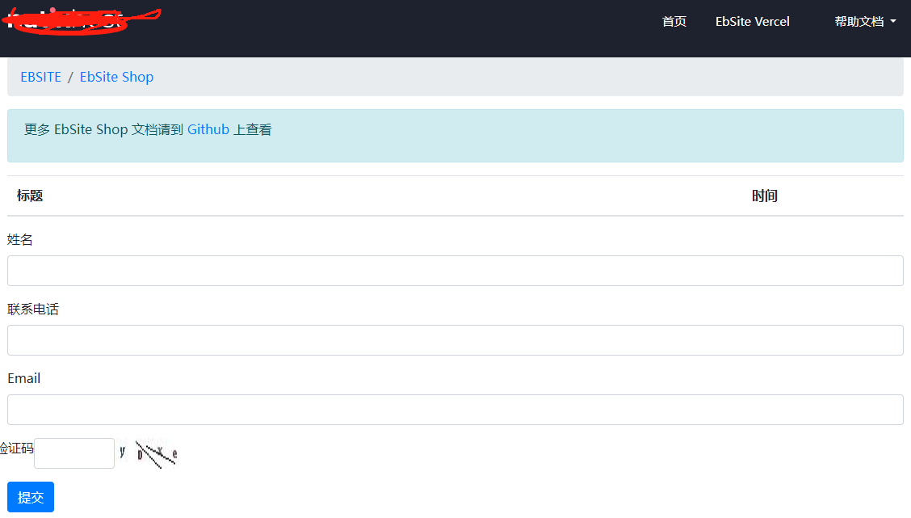

# 自定义表单的应用
EbSite Vercel 提供了非常便捷的自定义表单，你可以使用自定义表单收集相关数据，创建一个表单大概有以下流程。

### 一、创建表单

注意字段的最大长度，为了防止用户输入太长的信息，可以限制这个表单下每一个字段允许的最大长度。


 

###  二、添加表单中的字段

进入表单的【字段管理】管理，可以在这里添加或删除相应的表单字段


### 三、获取表单的调用代码
表单的调用代码在【字段管理】中获取
点击上面的【调用代码示例】按钮，可以查看当前表单调用的示例代码，这只是一个示例代码，你可以在此基础上调整表单控件顺序，样式等。

其中form的ID就是你创建表单的数据ID，表单中的控件名称是添加表单时的字段名称

```html
<form id="f_64dd9133197c52f67a6693c1" onsubmit="return on_custom_form(this)" method="post" >
<div class="mb-3">
  <label>姓名</label>
  <input name="RealName" minlength="1"  class="form-control" required>
</div>
<div class="mb-3">
  <label>联系电话</label>
  <input name="MobileNumber" minlength="1"  class="form-control" required>
</div>
<div class="mb-3">
  <label>Email</label>
  <input name="Email" minlength="1"  class="form-control" required>
</div>
<button class="btn btn-primary mb-3 mt-3" type="submit">   提交   </button>
</form>

        
```


### 四、表单模板

在EbSite Vercel中没有专门的表单模板，表单的提交是异步的，你可以将上面获取到的表单代码放在任何模板中，比如首页，列表页，内容页面，当然你也可以放在自己创建的页面，但要引用EbSite Vercel自带的Js文件。
比如将放在列表页面：




### 五、查看表单数据

在表单管理中，你可以选择相应的表单，进入查看数据，即可查看用户提交上来的数据了。


